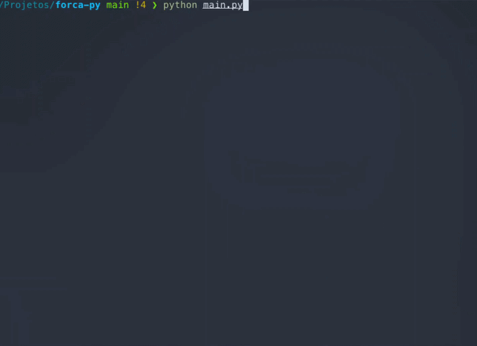

# Jogo da Forca

Jogo da forca, feito em python rodando diretamente no terminal.

## Sobre

O projeto utiliza bibliotecas nativas do python para criar um TUI (Terminal User Interface) de um jogo da forca, utilizando ASCII art e ANSI escape codes para construir uma interface visualmente limpa e responsiva, insírado nos editores de texto [Nano](https://www.nano-editor.org/) e [NeoVim](https://neovim.io/).

## To do:

- Sistema de pontuação
- Tema
- Categorias
- Níveis de dificuldade
